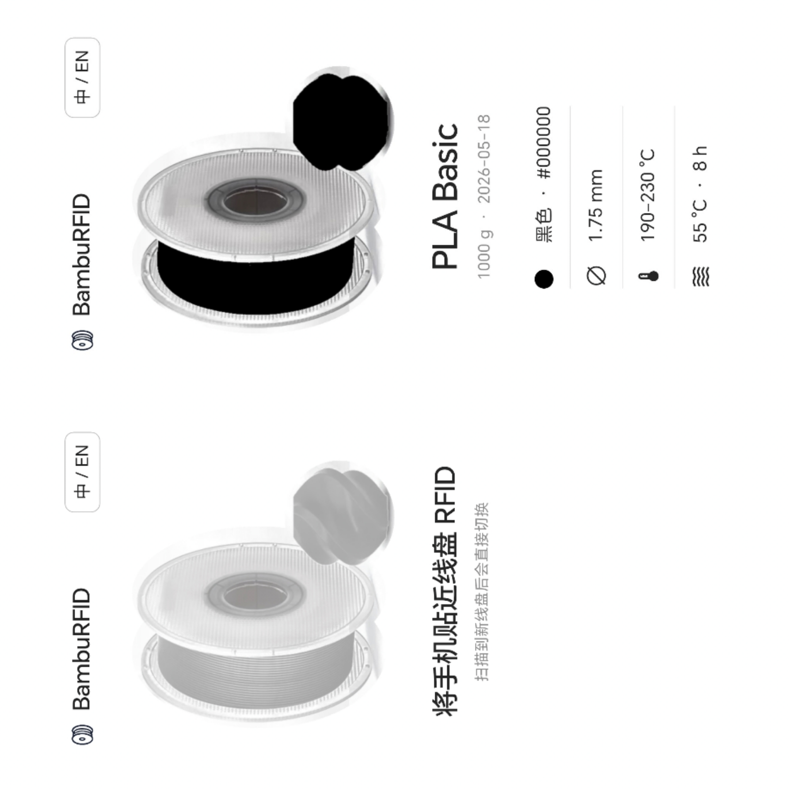

# BambuRFID

<p align="center">
  <a href="README.en.md">English</a> | 中文
</p>

<p align="center">
  
</p>


BambuRFID 是一款仅面向 Android 的极简 Flutter 应用，通过手机 NFC 读取兼容的 Bambu Lab 耗材 RFID 标签，并直接展示耗材信息。

<p align="center">
  
</p>

## 功能特性

- **即扫即显**：扫描到标签后直接切换当前耗材，无需额外操作。
- **双语支持**：首次启动按设备语言自动选择中文或英文；手动切换后通过 Android `SharedPreferences` 持久化记忆。
- **极简界面**：纯白单页设计，无卡片堆叠、无渐变、无玻璃拟态；核心信息始终在一页内完整显示。
- **耗材信息**：展示颜色名称与 `#RRGGBB` 色值（双色标签显示两个 Hex）、直径、喷嘴温度范围、烘干参数及重量与生产日期。
- **动态耗材图**：采用透明线盘固定层 + 可动态换色的耗材明度层双图层结构。

## RFID 实现

Android 原生层位于 `android/app/src/main/kotlin/com/bamburfid/app/MainActivity.kt`，主要流程：

1. 通过 `NfcAdapter.enableReaderMode` 持续监听 NFC-A 标签。
2. 使用 Android `MifareClassic` API 访问兼容标签。
3. 按公开研究中的 HKDF-SHA256 方式由 4-byte UID 派生扇区 Key A / Key B。
4. 认证并读取前 5 个扇区的数据块，解析材质、颜色、重量、直径、生产日期、喷嘴温度及烘干参数。
5. 单线程 latest-tag 队列处理连续扫描，单次读取失败自动重试，定期刷新 ReaderMode 以降低 NFC 栈陈旧状态概率。
6. 通过 Flutter `EventChannel` 将结果推送至 Dart UI。

> 即使 Android 手机具备 NFC，也不一定支持 MIFARE Classic，实际支持取决于 NFC 控制器与厂商实现。

## 语言记忆

项目不依赖额外的 Flutter preference 插件：

- Dart 首次启动以 `platformDispatcher.locale.languageCode` 判断设备语言。
- Android 原生层使用 `SharedPreferences` 保存 `zh` / `en`，后续启动优先使用用户选择。

## 耗材图片

| 资源 | 路径 |
| --- | --- |
| 线盘固定层 | `assets/spool_base.png` |
| 耗材明度层 | `assets/spool_color_luma.png` |
| 原始参考图 | `tool/reference/spool_reference.png` |
| 重新抠图脚本 | `tool/build_spool_assets.py` |

抠图脚本仅用于重新生成图片资源，不参与 App 构建，运行需 Python、Pillow、NumPy、OpenCV。

## 构建

要求：Flutter SDK、Android SDK、JDK 17+。

```bash
cd BambuRFID
flutter pub get
flutter build apk --release
```

开发运行：

```bash
flutter run
```

APK 通常输出至 `build/app/outputs/flutter-apk/app-release.apk`。

### Gradle 下载网络受限

项目包含完整的 `android/gradlew`、`android/gradlew.bat` 与 `android/gradle/wrapper/`。若 `services.gradle.org` 跳转 GitHub 后网络失败，可使用项目根目录脚本：

```bash
chmod +x fix_gradle_local.sh
./fix_gradle_local.sh /path/to/BambuRFID
```

或为终端 / Gradle 配置本机 HTTP 代理后直接构建。

### Release 签名

当前 `release` 构建仍使用 debug signing，便于本地直接生成 APK。正式发布前请在 `android/app/build.gradle.kts` 中替换为自己的 release keystore 配置。

## 开源声明

BambuRFID 是完全开源的非商业项目，不以盈利为目的，不涉及任何商业利益，也不参与商业活动。

项目主要参考：

- [`queengooborg/Bambu-Lab-RFID-Tag-Guide`](https://github.com/queengooborg/Bambu-Lab-RFID-Tag-Guide)：RFID 数据结构、读取方式与密钥派生研究。
- [`queengooborg/Bambu-Lab-RFID-Library`](https://github.com/queengooborg/Bambu-Lab-RFID-Library)：标签样本数据与字段验证参考（上游标注 GPL-3.0）。
- Flutter SDK：界面框架。
- Android NFC / `MifareClassic`：原生 NFC 访问。

详细说明见 [`NOTICE.md`](NOTICE.md) 与 [`LICENSE`](LICENSE)。

## License

BambuRFID 项目代码按 GNU GPL v3.0 发布，完整文本见 `LICENSE`。

"Bambu Lab" 及相关商标归各自权利人所有。本项目为独立社区工具，与 Bambu Lab 无隶属、授权或背书关系。
